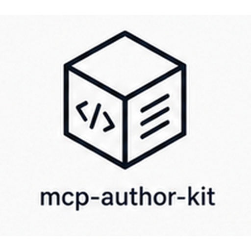

<p align="center">
  
</p>

# mcp-author-kit

> Scaffold, grade, test, and debug MCP (Model Context Protocol) servers from inside Cursor.

[](https://nodejs.org)
[](./LICENSE)
[](https://nitishagar.github.io/mcp-author-kit/)

## Installation

### From the Cursor marketplace (recommended)

1. Open Cursor → **Settings → Plugins → Marketplace**.
2. Search for `mcp-author-kit` and install.
3. Restart Cursor. The bundled MCP server registers automatically.

### Manual install (for development or pre-marketplace use)

```bash
git clone https://github.com/nitishagar/mcp-author-kit.git
cd mcp-author-kit
pnpm install
pnpm release-check
pnpm install:dev          # symlinks the 5 skills + /test-mcp into ~/.cursor/skills-cursor/
```

Then add the MCP server to `~/.cursor/mcp.json`:

```json
"mcp-author-kit": {
  "command": "node",
  "args": ["/absolute/path/to/mcp-author-kit/server/bundle/index.js"],
  "transport": "stdio"
}
```

Quit Cursor (Cmd-Q) and reopen. Confirm the server appears under **Settings → Tools → Installed MCP Servers** with all 5 tools, and that typing `/` in an agent chat shows `/test-mcp`. Run `pnpm uninstall:dev` to remove the skill symlinks.

## Configuration

Nothing required. The MCP server ships as a single bundled artifact at `server/bundle/index.js` and is auto-registered via `mcp.json`. No `pnpm install` or build step is needed for end users.

Requires Node 20+.

## What's in the box

- **Skills** (`skills/`) — five agent skills:
  - `scaffolding-mcp-server-python` — copy the Python stdio template into a workspace and bring it to a green smoke test.
  - `scaffolding-mcp-server-typescript` — same shape, TypeScript starter.
  - `designing-mcp-tool-descriptions` — rubric-driven loop to fix tool descriptions until they score ≥ 85.
  - `testing-mcp-server-locally` — five-step end-to-end smoke test using the bundled tools.
  - `debugging-mcp-server` — triage failing servers via stderr capture, schema introspection, malformed inputs.
- **Templates** (`templates/`) — minimal, bootable starters:
  - `python-stdio` — `pyproject.toml` + `__main__.py` with a working `echo` tool and stderr-safe logging.
  - `typescript-cf-workers` — Node-stdio TS starter with the same shape; Workers deploy is a follow-on.
- **MCP utility server** (`server/`) — bundled into a single ESM file, exposes five tools (see [Tools reference](#tools-reference)).
- **Slash command** (`commands/test-mcp.md`) — `/test-mcp` runs the full inspect → grade → smoke-plan flow and prints a one-screen report.

## Quickstart

Once installed, drop these into a Cursor agent session against the included echo fixture (`tests/fixtures/echo-server.mjs`):

1. *"Inspect the MCP server `node tests/fixtures/echo-server.mjs`"* → enumerates tools, resources, prompts.
2. *"Grade the description of the `echo` tool"* (paste the spec from step 1) → score + actionable issues.
3. *"Run /test-mcp against `node tests/fixtures/echo-server.mjs`"* → full inspect → grade → smoke flow.
4. *"Tail the logs of `node tests/fixtures/echo-server.mjs` for 1 second"* → captured stderr.
5. *"Call the `echo` tool on `node tests/fixtures/echo-server.mjs` with `msg=hi`"* → invokes the tool, returns timing.

## Tools reference

| Tool | Input | Output |
|---|---|---|
| `inspect_mcp_server` | `command`, `args[]` | tools, resources, prompts of a target MCP server |
| `grade_tool_description` | tool definition | rubric score (0–100) + ranked issues |
| `tail_mcp_logs` | `command`, `args[]`, `duration_seconds` | captured stderr lines for the window |
| `call_mcp_tool` | `command`, `args[]`, `tool_name`, `arguments` | tool response + latency |
| `generate_smoke_tests` | `command`, `args[]` | markdown smoke-test plan composed from inspect + rubric |

## Development

```bash
pnpm install
pnpm release-check    # typecheck → test → bundle → smoke-boot
```

Other scripts:

- `pnpm test` / `pnpm test:watch` — vitest
- `pnpm typecheck` — root + server tsconfig
- `pnpm bundle` — produce `server/bundle/index.js` (committed; do not edit by hand)
- `pnpm smoke:boot` — spawn the bundle in `/tmp` and verify `tools/list` returns ≥ 5 tools

See [`AGENTS.md`](./AGENTS.md) for the inner-loop discipline.

## License

MIT — see [LICENSE](./LICENSE).
